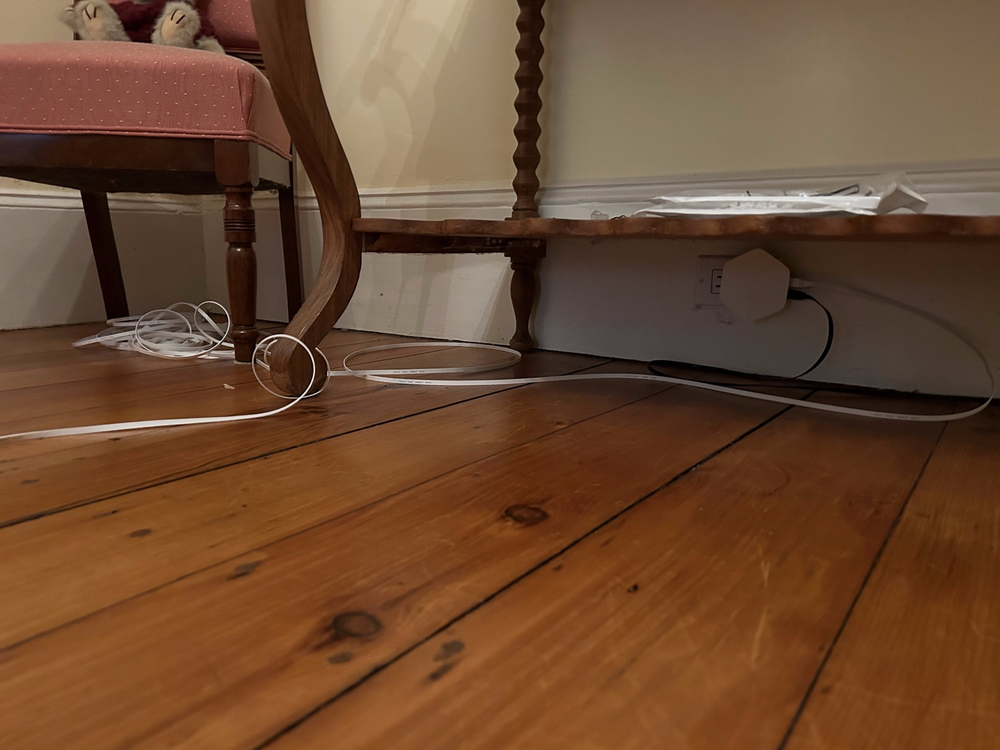
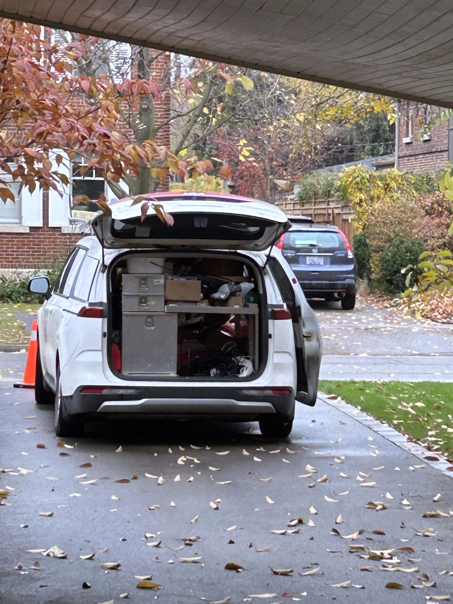
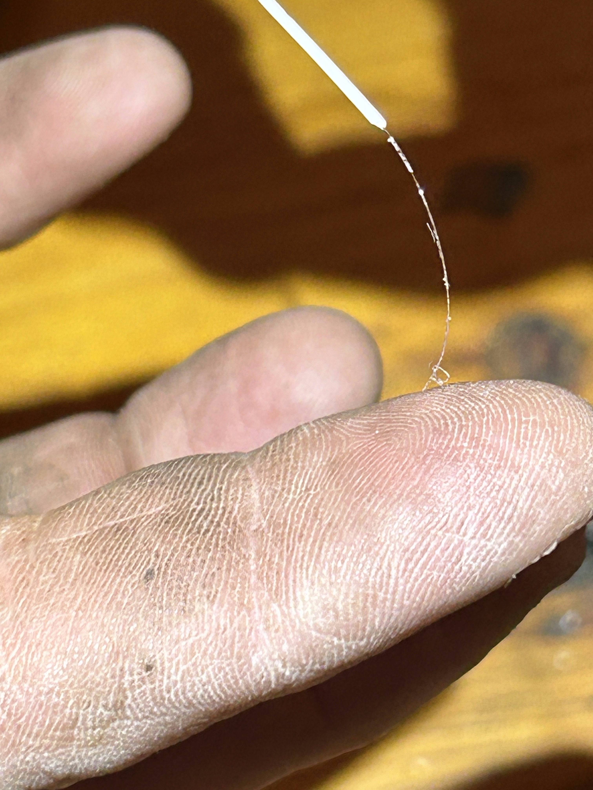
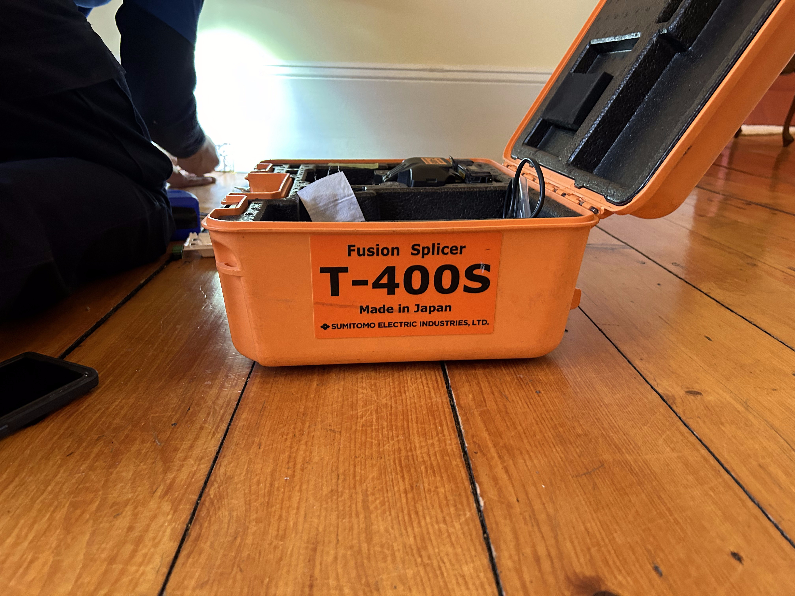
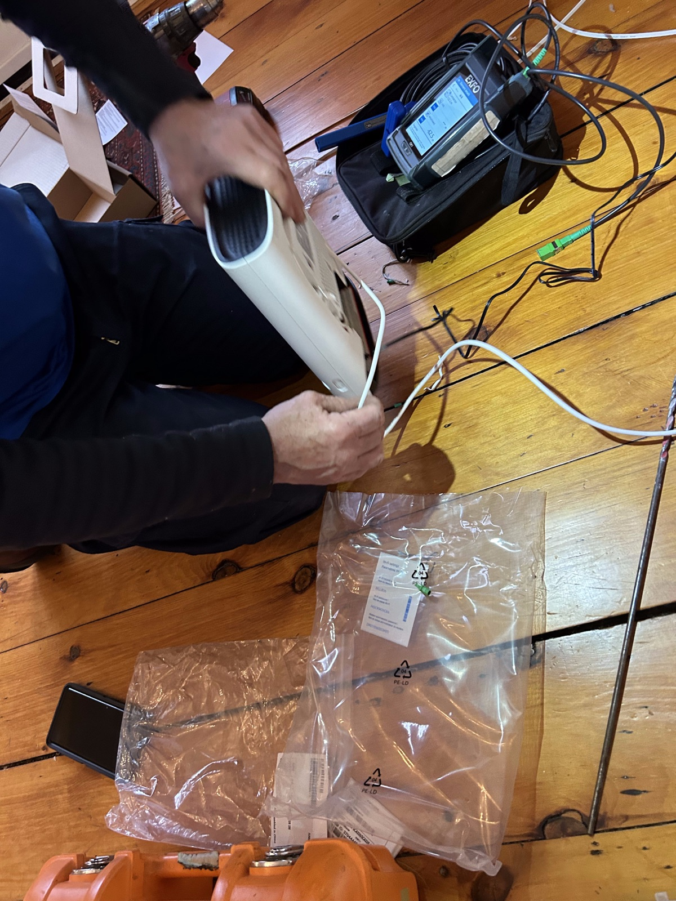
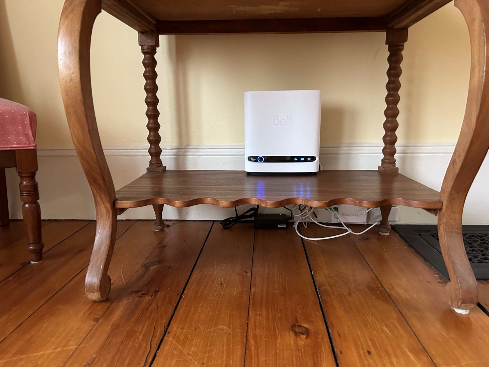
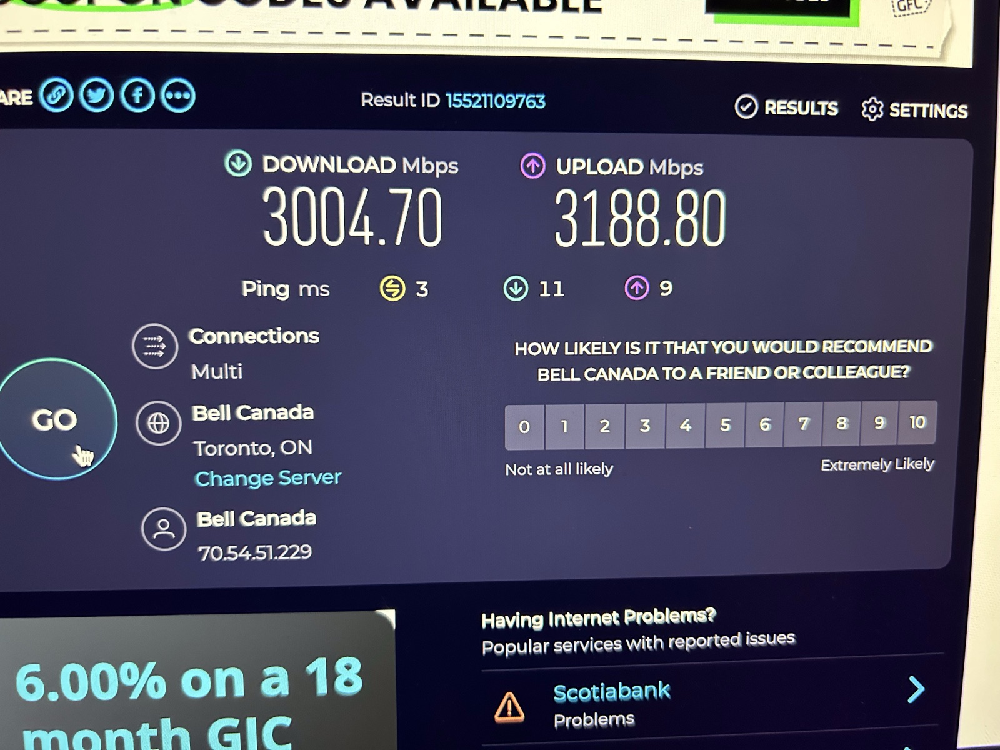

When life gives you lemons, you don't have to make lemonade do you?

This post describes my recent experiences that involved "six cats" or, more accurately, Ethernet Category Six (Cat 6 versus Cat 5) cables, fiber optic internet connections, and related things. You might take this as an endorsement of fiber optic internet connections (i.e., information travelling by light), which I guess it is. But it is more a story of how I was unwittingly nudged to switch from a coaxial cable-based to a fiber optic cable-based internet service provider, and the unexpected consequences of that switch.

Some background is in order. More than a decade ago we bundled many home utilities (cellular phone, land line phone, internet, television) into a single package with a single provider, Bell Canada (back then they offered a maximum of 100 Mbps download and 10 Mbps upload speeds if memory serves). But my workflow often involves shuffling large amounts of data back and forth among compute clusters, my home computer, and my work computer at the university, which taxed the transmission network. And although for years Bell kept promising that we would see fiber optic services in our neighborhood, each time I inquired I was told "coming soon" yet it never quite materialized. Then a competitor (Cogeco) announced that they were providing a much faster service in our neighborhood based on a coaxial backbone (1 Gbps download, 30 Mbps upload) and I switched, and was fairly happy, though we did experience the occasional coaxial line issue over the years (caused by corrosion at the pole connection outside, though the issue was typically resolved shortly after reporting deteriorating transfer speeds).

Then, a few years ago, Bell finally announced that there was fiber available in our neighborhood (via a knock on our door), but I didn't feel compelled to switch (there was no difference in available download speeds). However, in early October 2023 the coaxial speeds dropped (upload speeds in particular) and the service became unacceptably slow, since less than 15 Mbps upload speeds while using rsync to synchronize home and work computers was interfering with my workflow. So naturally I contacted Cogeco, and a total \*\*\*t show erupted involving 5 visits from technicians over a one month period who never seemed to arrive with the right equipment, or were not given any instructions or details about previous visits, and so on. So, after the 5th visit where the tech again pronounced "you have a signal problem" (diagnosed by the 1st tech after his 2nd visit in one day when he arrived with a broken signal meter and had to head out to retrieve a working one) I started thinking "maybe the universe is whispering to me something about switching providers".

But fate can be finicky. The first Cogeco tech who visited to fix the signal issue in early October said that Cogeco offers newer Wi-Fi equipment that what we were operating with (mesh Wi-Fi 6) and on the 3rd visit they switched out our equipment and then the show began (the old equipment was a router and two *wired* extenders that serviced the entire house fairly well, albeit with quite slow upload speeds, the new equipment was a router and two mesh Wi-Fi *pods*). After the "upgrade" we had much worse network coverage throughout the house, and they recommended getting additional pods which grew to 6 in total. But still things were not functioning well at all, and I started digging around for information on the equipment Cogeco was using (Sagemcom Fast 3896 Gateway and Plume Wi-Fi 6 Superpods) and realized that I might need to hard wire the pods to the router. So, to experiment we bought two 100 foot Cat 6 Ethernet cables off Amazon for \$20/each and started to dig into things.

{fig-align="center" width="300"}

But by happenstance fate intervened while I was getting up to speed on mesh network technology. I read that in order to get the best speeds from my computer I should connect my computer directly to a mesh pod or, better still, directly to the router if at all possible ("backhaul" is a term I soon became familiar with). So I experimented with a direct connection first to a pod and then to the router, testing speeds each time, after which the speeds were pretty impressive (1 Gbps download, but sadly still 15 Mbps upload due to the ongoing signal issue). I also learned that these routers have one 10 Gbps port, the rest being 1 Gbps. In effect, Cogeco's \*\*\*t show turned into a learning experience in many unexpected ways. I discovered a utility called *networkQuality* that measures realized network speed (open software written by 3 Apple engineers), and was getting around 800 Mbps down and 15 Mbps up using this metric. You may think "this guy is an idiot, everyone knows they should do this", but I didn't, and I am probably not alone.

Let me also point out a totally unexpected and additional benefit arising from the Cogeco \*\*\*t show. After running *networkQuality* at home, I tried it at work, and was surprised to say the least. My office at the university has 1 Gbps Ethernet, but I was only seeing 80 Mbps up and down according to *networkQuality*? WTF?

I contacted University Technology Services (UTS) and they tested the line and confirmed, but suggested I first try a different patch cord, which I did, and the culprit was a short Cat 5 Ethernet cable that apparently has a maximum transmission speed of 100 Mbps.

My email to UTS, for posterity:

> Greetings, 
>
> I am noticing that the network speed in my office is quite slow, and transferring some larger files takes longer than I would expect (I expect around 1 Gbps for a hard wired connection, hence my inquiry).
>
> Running networkQuality (macOS Sonoma, new iMac with Apple Silicon, with static IP/Ethernet) reveals, consistently, around 85 Mbps up and down... here is a recent summary...
>
> ==== SUMMARY ====\
> Uplink capacity: 83.883 Mbps\
> Downlink capacity: 84.392 Mbps\
> Responsiveness: Medium (186.335 milliseconds \| 322 RPM)\
> Idle Latency: 12.125 milliseconds \| 5000 RPM
>
> So, my question is whether this is somehow compromised or not? In other words, why is the connection so slow, and what can be done to increase the speed? On my home connection I get 10x these speeds with a plain vanilla setup, and would expect it to be if anything faster on campus.
>
> Thanks!

Their response, for posterity:

> Hi Jeff, the connection for **130.113.139.86** is connecting on our switch at 100 Mbps instead of 1Gbps, assuming the device is capable of that. I tried a port reset but it's still 100 Mbps. Sometimes a bad patch cord can cause this. Are you able to swap the patch cord, or swap it with another system to see if the problem follows?
>
> If that doesn't work I will have the line tested.
>
> **130.113.139.87** is connecting at 1Gbps.

I tried a Cat 6 cable and voila! 1 Gbps up and down! So, I had been living for years with 1/10th of the speed I was supposed to be getting caused by a short length of Cat 5 Ethernet cable from the dark ages. Thanks Cogeco! Without your \*\*\*t show I would have remained ignorant of this perhaps forever, so gratitude is in order.

The results from *networkQuality* on my university desktop computer after swapping out the Cat 5 patch cable, for posterity:

> ==== SUMMARY ====\
> Uplink capacity: 678.487 Mbps\
> Downlink capacity: 877.924 Mbps\
> Responsiveness: High (13.118 milliseconds \| 4574 RPM)\
> Idle Latency: 6.000 milliseconds \| 10000 RPM

This is when it dawned on me that its time to cut the cord with Cogeco and switch service providers as Cogeco remained totally unresponsive to my ongoing requests to address the slow coaxial upload speed at home. I knew from the knock on the door that Bell offered fiber in our neighborhood, and I found out that we could get 3 Gbps up and down for about the same price I was paying Cogeco for 1 Gbps down and 30 Mbps up. My final decision was made while tossing and turning early Saturday morning after a Friday evening visit from the 5th Cogeco tech who informed me "you have a signal problem" (duh, that's why you are here, dips\*\*\*, to *fix* it!). After a bit of a frustrating experience with Bell[^1] I ordered their service and waited nervously for the install which took place yesterday, Friday November 17, 6 days after deciding to switch. I was nervous as I didn't know whether they might need to dig up our front yard, whether they could move the router from the basement to a more central location, whether they could hard wire my computer to enable the full 3 Gbps experience, whether they could hard wire a pod to reach the far side of the house, etc., and they said the tech would arrive between 8-10 AM and that it would take between 4-6 hours (it took 6+). The Bell tech was a competent and seasoned professional who texted me prior to arriving to give me a heads up, arrived, inspected and said "I need to go off-site to turn on the light to the pole", and returned 20 minutes later and got to work.

[^1]: I desperately wanted a Bell representative to first inspect our property and let us know if there would be any installation issues before I ordered, but they don't allow that which is unfortunate as I was willing to pay out-of-pocket for someone to do so - put this in the Bell Suggestion Box.

{fig-align="center" width="300"}

He next ran fiber optic cable from the pole to the house, drilled a hole in the exterior wall to thread the cable into the house, and then relocated the router to the middle of the house on the main floor and threaded the cable directly to the new location with zero splices (the old router was situated on one side of the house in the basement where the coaxial cable entered the house, anything but central).

{fig-align="center" width="300"}

{fig-align="center" width="300"}

{fig-align="center" width="300"}

After the main fiber cable was installed, glass fused at the router side to create a wall mount connection, and the router plugged in and tested, we fished Ethernet cables to my computer and to a pod on the far side of the house (a two-person job and I was more than happy to participate), and though the tech had brought 6 pods at my urging we kept only 4 and he felt that even this was overkill (he was right, we only need at most 3, and some online sleuthing revealed that the Bell branded equipment was a Sagemcom Fast 5689E gateway and Plume Wi-Fi 6E Superpods). When we first fired up my computer to test the transfer speeds (a 2023 M2 Apple Mac Studio), it was only measuring 1 Gbps up and down and I suspected a cable issue, but he had unknowingly plugged the cable into the 1 Gbps port and once he connected instead to the 10 Gbps port we instantly measured 3 Gbps up and down[^2], and he was positively giddy and took a screenshot declaring it was the fastest he has ever seen (typically maxes out around 2.5 Gbps he said - we subscribed to their 3 Gbps up/down service, the fastest currently offered in our neighborhood). Post-installation I experienced some interference glitches, and the Bell Wi-Fi app won't be available to me for a week as this is a new install so I can't yet fully optimize the system, but otherwise all is good. On Wi-Fi the transmission speeds range from roughly 250 Mbps to 750 Mbps (fastest near the router and wired pod), and hard wired to the 10 Gbps port we are consistently seeing 3 Gbps up and down. And, as an aside, the Bell Fibe TV is much better than Cogeco's, and the Bell Fibe TV app is very well designed (we can watch TV on a phone, tablet, laptop or desktop anywhere in the house by simply pointing a browser at [tv.bell.ca](tv.bell.ca), and it is super fast and responsive). So, at the end of the day we have much faster internet (and hopefully more reliable), a better TV experience, no increase in price and the very latest Wi-Fi 6E equipment - color me happy!

[^2]: Sgt. Major Dickerson \[Pointing to his rank insignia\]: What does three up and three down mean to you, airman? Adrian Cronauer: End of an inning? Goooooooood morning Vietnam!

{fig-align="center" width="300"}

{fig-align="center" width="300"}

Epilogue - Cogeco's *\*\*\*t show* nudged me to learn about mesh networking, Ethernet cable transmission speeds (Cat 5 versus 6), Wi-Fi 6 versus Wi-Fi 6E (Cogeco supported the former, Bell the latter), coaxial versus fiber cabling, and inadvertently led me to diagnose a network issue that had affected me for far too many years at work. My wading through the network tech literature allowed me to determine a better location for the router in our home, figure out how to get my system running at the fastest possible speed, and wind up in a far better place both at home and at the university. Hat-tip to Bell as a company, to the Bell manager who patiently walked me through the installation process and detailed all of the unpleasant yet uncommon things that might have occurred during installation (but did not, thanks Anar!), and most of all to the Bell tech who patiently tolerated my desire to get the most from their fiber optic network (thanks Chris!). I am truly grateful, and have benefited both from Cogeco's failure and from Bell's poaching prowess and professionalism.

{fig-align="center" width="300"}
