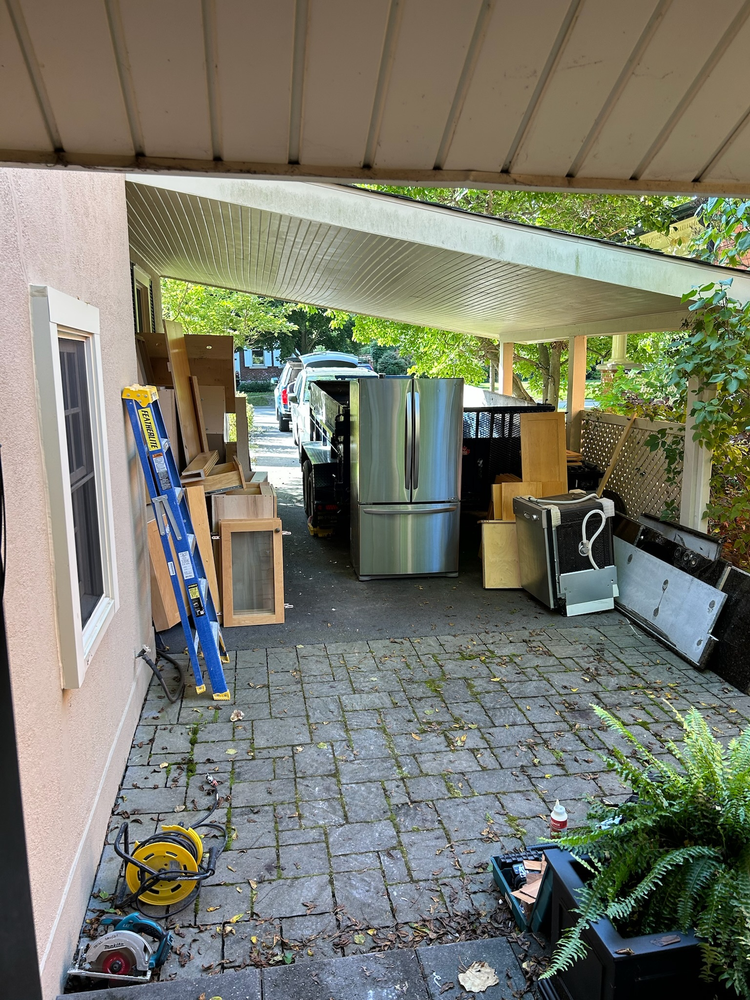

Spending your kids' inheritance on a kitchen renovation is taxing in
more ways than one. You have to deal with the mess, the noise, the dust,
the inconvenience, the cost, and the stress. But the journey was worth
it. The kitchen is the heart of the home, and it's where we spend most
of our time.

We have some kitchen renovation experience from our previous home in
Syracuse (a 1910 Tudor-style home), and there we used a functional but
inexpensive Home Depot designed kitchen completed in 2003. When we
bought our current home in Dundas (an 1816 Heritage home), the previous
owners had spruced up the kitchen with maple door cabinets and
engineered flooring layered on top of plywood layered on top of the
original wide plank pine flooring. The kitchen was functional, but after
20 years of daily use it was tired, appliances were failing, and the
cabinets were showing their age. In 2023 we decided it was time to take
the plunge and do a full kitchen renovation, though the thought of
washing our dishes in our bathtub for months on end almost deterred us
from taking this one on.

In the spring of 2024 we settled on a contractor and cabinet maker and
planned to start construction early in the Fall of 2024. Construction is
expected to be finished hopefully by the New years in 2025.

I charted progress with photos, and in the pictorial timeline below the
left top three pictures are of the same objects throughout, namely the
main kitchen, pantry/laundry, and mudroom, while other pics appear for
posterity in no particular order.

# Pre Renovation Gallery

The main areas of the kitchen that needed attention were the main
kitchen, pantry/laundry, and the mudroom hall. There was also a window
hidden in the mudroom closet with insulation showing on the outside (top
row of pictures). Counters were scratched, laminate coming off,
appliances worn out, and the backsplash by the sink calcified while
wooden window jambs were cracked and in poor shape.

::: {layout-col="4"}
{width="150" fig-align="center"}
{width="150" fig-align="center"}
{width="150" fig-align="center"}
{width="150" fig-align="center"}

{width="150" fig-align="center"}
{width="150" fig-align="center"}
{width="150" fig-align="center"}
{width="150" fig-align="center"}
:::

# Demolition and Structural Repairs

The first step was to remove the old cabinets, countertops, and
appliances. The multiple layers of non-original flooring was removed
down to the original wide plank pine flooring that was covered in glue
and concrete for levelling. The pantry/laundry area was gutted, and the
mudroom closet was removed to expose then remove the exterior window
with the insulation showing through the exterior glass. Ceilings had
been lowered and a beam ran across the kitchen, while a box hid the
stairs going upstairs to the loft above the kitchen. The beam was
removed, and the box was torn down to reveal the stairs. The ceiling was
raised to the original height, a hidden LVM beam was added which
replaced the previous intrusive beam and the walls were insulated and
drywalled. The old retro-fit windows with cross-bards that previously
were above the sink were replaced with larger single-pane windows that
were more in keeping with the original style of the house.

::: {layout-col="4"}
{width="150"}
{width="150"}
{width="150"}
{width="150"}

{width="150"}
{width="150"}
{width="150"}
{width="150"}
:::

# Construction & Floors

We were really apprehensive about the floors, as we had no idea what we
would find under the layers of flooring. But fortunately the original
wide plank pine floors were in fairly good shape, though they were
covered in glue and concrete. We had to remove the glue and concrete,
then sand the floors down to the original wood. The floors were then
sealed with a neutral finish. The pantry/laundry area was reconfigured
to allow for a sink, countertop, and backsplash. The mudroom was
reconfigured to allow for a new and larger, more functional, closet. The
walls were insulated and drywalled, and the ceilings were raised to the
original height. The new windows were installed, and the floors were
refinished.

::: {layout-col="4"}
{width="150"}
{width="150"}
{width="150"}
{width="150"}
:::

# Cabinet Installation

With the demo and construction complete, floors were refinished then
protected under 1/4 inch plywood, then cabinets were installed. The
cabinets were custom made by a local cabinet maker, and the windows were
made locally but this time not with wood but with PVC to avoid water
damage (the jamb will be quartz up to the window for ease of cleaning
and longevity). The pantry/laundry area underwent the biggest change
removing a wall that hid the pantry shelving, the installing floor to
ceiling cabinets, a sink and countertop/backsplash, and the side-by-side
washer/dryer was stacked and moved.

::: {layout-col="4"}
{width="150"
fig-align="center"} {width="150"
fig-align="center"} {width="150"
fig-align="center"} {width="150"
fig-align="center"}
:::

# Countertops, Painting, and Finishing Touches

To be continued...

# What We Don't Miss...

Our dining room standing in for our old kitchen, our bathtub standing in
for our old dishwasher, and an induction pan and countertop "oven"
standing in for our old stove.

::: {layout-col="4"}
{width="150"}
{width="150"}
{width="150"}
:::
